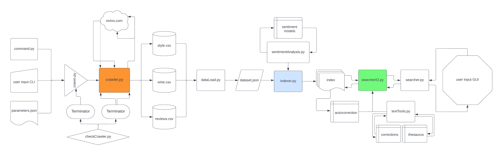

<h1 align="center">WineTz</h1>

<div align="center">


[](https://shields.io/)


</div>

## 📝 Table of Contents

- [About](#about)
- [Prerequisites](#prerequisites)
- [Usage](#usage)
- [About the code](#Code)
- [Built Using](#built_using)
- [Authors](#authors)

## 🍇 About <a name = "about"></a> 

WineTz is a powerful tool that leverages sentiment analysis techniques to provide insights into the emotional tone of wine reviews. 
<br><br>
Whether you're a wine enthusiast, a sommelier, or a data-driven marketer, our engine helps you navigate the rich landscape of wine opinions.

<!--  -->

## 🌂 Prerequisites <a name = "prerequisites"></a> 

All requirements are described in `requiriments.txt`
- Python 3.11.1 
- nltk 3.8.1
- pandas 2.1.4
- Requests 2.31.0
- tqdm 4.66.1
- transformers 4.34.1
- Whoosh 2.7.4
- langdetect 1.0.9
```
pip3 install <module>
```


## 🎈 Usage <a name="usage"></a>

In this section: general overview of wineTz, main tools implemented.

### ⚖️ Start crawling

`crawler/crawler.py`

When WineTz starts its tasks, it prints the number of matches obtained through requests to the *vivino.com* API.
Afterwards, you will see a progress bar describing the progress of the review retrieval.

WineTz creates an output folder */out*. Inside */out* create a directory for each exported dataset.<br>
Inside the *dataset directory*, WineTz exports three *.csv* files: wines, style and reviews:

*wine.csv* contains information about wines <br> *style.csv* provides information on wine styles <br> *reviews.csv* the reviews of each wine.

Automatically, a fourth *.json* file is created: *parameters.json*.<br>
This file contains the parameters used for scraping. By copying this file to the *crawler/input/*, you can scrape with the same search parameters.

[detailed information about _web crawler_](crawler/README.md)

### 📏 Indexer

`indexer/indexer.py`

After downloading the data, wineTz has a suite to index the data, and calculate sentiment analysis measures. <br> <br>
It's possible to download analysis models, and change the relative paths in the `sentimentAnalysis.py` module. An index folder will be created inside the main project directory.

### 🔭 Searcher

`searcher/searcher.py`

wineTz has a graphical interface to propose queries and perform searches. <br> <br> 
Various functions are implemented within the GUI, including: search filters, complex natural language queries, search expansions using thesaurus and proofing tools.

## 🚀 About the code <a name = "Code"></a>


### The contents of the folders in more detail:

1. **Web Scraping from vivino.com** {#crawling}
   - The crawler, located in the `/crawler` directory, is responsible for downloading data from *vivino.com*. The details of its functioning are defined in the README.md file within the corresponding directory.
   - After defining the search parameters, the crawler downloads the data into the `out/dataset` folder with corresponding timestamps.

2. **Data Representation with dataset.json**
   - The `/data` folder contains a script named `dataLoad.py`, which works with two directories: `/data/input` and `/data/dataset`.
   - `indexer.py` operates with a file named `dataset.json`, which has a specific structure (example in `jsonStructure.json`).
   - The `dataset.json` file is created by running the `dataLoad.py` script. To create `dataset.json`:
     - Run dataLoad.py:
       ```bash
       python3 dataLoad.py
       ```
     - The script will ask for the input folder path for the .csv files:
       ```bash
       Type path directory of .csv from crawler or other> 
       ```
       Pressing enter without typing the path loads .csv files automatically from the `/data/input` folder.
       For convenience, copy the contents of the data directory from the crawler into the `/data/input` folder.
     - Two files will be created inside `/data/dataset/`: `dataset.json` and `dataset.csv`.
   - `dataLoad.py` creates a folder at the path `/data/dataset/archive` and creates two copies of the dataset: the first inside the archive, the second inside `/data/dataset/`
   - `dataLoad.py` is used to obtain an organized and clean file without redundancies.

3. **Indexing Data with Sentiment Analysis**
   - The `/indexer/indexer.py` script creates the index starting from the `dataset.json` file:
     ```bash
     python3 /indexer/indexer.py
     ```
   - The script accepts a parameter using the `argsparse` library:
     ```bash
     python3 /indexer/indexer.py -o
     ```
     This parameter was used to employ `indexer.py` with offline sentiment analysis models.

4. **Navigate indexed data via graphical interface**
   - The `/searcher/searcher.py` loads GUI with function to navigate into items indexed collection:
     ```bash
     python3 /searcher/searcher.py
     ```
        `/searcher/searcher.py` it is based on the code implemented in the other two files `/searcher/searcherIO.py` and `/searcher/textTools.py`. <br>
    - Automatically, during the startup phase, the GUI tries to load the index at the `/../index` path.
         `/../index` path where by default indexer.py creates the index of the dataset.<br>
    - Via GUI it is possible to flag a set of parameters and values, including different types of wines, price ranges, search fields, etc.

5. **Conduct search engine benchmarks**
    - The `/benchmark/benchmarks.py` it is useful for proposing different queries, specifying the search parameters, and for specifying a relevance value for each query.
    - The value entered will then be used to obtain DCG and NDCG measurements.
     ```bash
     python3 /benchmark/benchmarks.py
     ```
    - Currently, some queries are already described. To change them, be careful when entering the parameters.


Note: <br>
Currently, the textual procedures are activated, tested and working exclusively for the Italian language.
In the modules, the code is prepared for easy loading of other templates for other languages.

## ⛏️ Built Using <a name = "built_using"></a>
Technologies and libraries:
- Python 3.11.1 

Sentiment Analysis Models:
    
- IT classifier: *MilaNLProc/feel-it-italian-emotion* [https://huggingface.co/MilaNLProc/feel-it-italian-emotion]
- EN classifier: *cardiffnlp/twitter-roberta-base-sentiment-latest* [https://huggingface.co/cardiffnlp/twitter-roberta-base-sentiment-latest]

## 👨🏻‍🔬 Authors <a name = "authors"></a>

- [@piltxi](https://github.com/Piltxi/) *excellent singer after some wine* and amateur developer